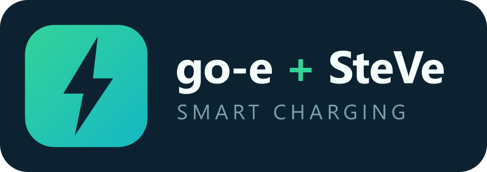

<p align="center">
  
</p>

# go-e + SteVe Smart Charging (Home Assistant)

A HACS custom integration that turns Home Assistant into the **smart-charging brain**
for a [go-e](https://go-e.com) wallbox, while [SteVe](https://github.com/steve-community/steve)
runs alongside as the OCPP backend for authorization and billable metering.

HA regulates charge power by talking to the go-e charger **directly over its native MQTT**
(no separate go-e integration needed), and SteVe owns *"may it charge / how much did it
charge"*. They coexist because the go-e applies the **minimum of all active current limits**.
See [`docs/concept`](#concept) for the full design.

> **Status: early days, actively tested.** All charging modes (solar, price-aware,
> combined), automatic phase switching and the single home-battery reserve line are in
> place, plus SteVe metering (per-RFID kWh, sessions), authorization/remote-control services, and
> **two bundled Lovelace cards** (an answer-strip main card + price-forecast). It works on the author's own
> setup, but it's still young and not every wallbox/inverter/price-provider combination has been
> exercised yet. **Try it, and please [open an issue](https://github.com/JustChr/HAgoe_steve/issues)**
> with what worked, what broke, or what you'd like — feedback shapes where this goes next. 🙏

## What it does today

- Reads your existing HA entities (grid power, optional PV / home-battery SoC & power, price) and
  the **go-e charger directly over MQTT** (car state, power, phases, session energy) — it owns the
  wallbox entities, so no separate go-e integration is required.
- It reacts to grid/PV/battery power changes **within seconds** (event-driven, debounced), with a
  30 s poll as a safety net, computing a target charging current and publishing it to the go-e's
  `amp` topic (writes are throttled so it doesn't chase noise); start/stop uses `frc`, phases `psm`.
- **Five modes, one brain:** Smart (solar first + cheap grid + a hard departure guarantee),
  Solar only, Solar + minimum, Fast, and Manual. Under the hood each mode enables a set of
  *strategies* that bid a charging power every cycle; the highest bid drives the charger.
- **One home-battery rule — the reserve line:** a single *"Keep home battery above X %"*
  number. Below the line the battery comes first (all solar fills it, the car gets only
  genuine excess); at/above the line the battery is a **fluctuation buffer** — the car follows
  the ~2-minute smoothed surplus and the battery bridges cloud dips instead of the car chasing
  them. Sustained discharge into the car is corrected, so the battery never becomes the car's
  power source. 100 % = always protect.
- **Battery-hold for grid charging:** map an optional "stop discharge" switch (e.g. a Victron
  helper) and the brain flips it on whenever it deliberately charges from the grid (cheap
  hours, the departure plan, Fast) so the car draws from the grid instead of draining your
  home battery. Solar surplus still charges the battery. An **Auto / Hold / Free** control (and
  a *Home battery held* sensor) lets you see and override that decision, and the card shows it
  as a shield chip.
- **Calm start/stop ("ride out, then stop"):** a solar start needs ~3 minutes of confirmed
  surplus; a surplus collapse is ridden out for ~5 minutes at minimum current before a clean
  stop — few, deliberate transitions instead of relay flapping.
- **Mode-aware 1↔3 phase switching** with anti-flap hysteresis and dwell timers: power modes
  (Fast, cheap-grid, deadline charging) use the full phase count, while solar-surplus charging
  prefers a single phase so a small surplus still charges. Enable the **Auto phase** switch —
  phase control (`psm`) is always available over MQTT.
- **Two Lovelace cards:** a main *answer-strip* card — a live charging figure with a ring + source
  bar splitting the car's power into **solar / battery / grid**, a one-line PV/house/grid/battery
  balance, the brain's plain-language reason, chips for state that used to be invisible (battery
  hold, price verdict, dwell countdowns, phases), a plan strip with a **draggable price target**,
  and inline controls (mode, Auto/Hold/Free home battery, the reserve line, the mode's tunables);
  plus a price-forecast card that plots upcoming prices with a **draggable "cheap" threshold**.
- Safety: if the car isn't connected or required data is stale, the brain keeps its hands off;
  turning **Smart control** off returns full manual control.

## Installation

1. In HACS → *Integrations* → custom repository, add this repo (category: *Integration*).
2. Install **go-e + SteVe Smart Charging**, restart Home Assistant.
3. *Settings → Devices & Services → Add Integration →* search for it.

**Prerequisites:** Home Assistant's **MQTT** integration set up against your broker, and the go-e
charger connected to that broker with **MQTT enabled and API writes allowed** (go-e app → *Internet
→ Advanced → MQTT*; since firmware 051.5 writes are off by default). No separate go-e integration is
needed — this integration talks to the charger directly.

## Setup

The config flow has three steps:

1. **Energy sources** — grid power (required; + import / − export), optionally PV production,
   home-battery charge level and battery power, an electricity-price sensor, and an optional
   home-battery **hold switch** (turned on to stop the battery discharging while charging the car
   from the grid). The price forecast is auto-detected from the sensor (Nordpool, EPEX Spot,
   EnergyZero, Tibber, …) — leave the override blank unless detection fails.
2. **go-e charger** — the charger's **MQTT base topic** (e.g. `go-eCharger/123456`),
   auto-discovered from your broker so you can pick it from a list, plus grid voltage and phase
   count. The integration then creates the wallbox entities (current, phases, force, car state,
   power, session/total energy, …) itself.
3. **SteVe (optional)** — base URL, an API user + its **API password** (set under *Users* in
   SteVe, not the login password), and an optional default charge box / connector for the
   remote start/stop services. Leave the URL blank to skip — the brain works without it.

Everything can be re-mapped later via the integration's *Configure* (options) dialog.

## Dashboard cards

The integration ships **two** custom Lovelace cards and **registers them automatically** — no
manual dashboard *Resources* entry needed. After setup, edit a dashboard, *Add card*, and pick
them from the card picker (both show a preview). With one Smart Charging device they auto-discover
all entities; if you run more than one, pick the device in the card's visual editor.

**1. Smart Charging card** (`custom:goe-steve-card`) — the main card, an **answer strip**: a big
live charging figure with a ring + source bar showing how much of the charge is **solar / battery /
grid** right now, a one-line balance (PV, house, grid ±, battery ± with SoC vs. the reserve line),
the brain's reason, and chips for the state it used to hide — the **battery-hold shield**, the price
verdict, live dwell countdowns and the phase count. A **plan strip** (Smart mode) shows the price
forecast with the booked cheap windows and a **draggable price target**, and a segmented mode control
plus an **Auto / Hold / Free** home-battery three-way sit below. The session duration ticks live.

```yaml
type: custom:goe-steve-card
# device: <optional — auto-detected when there's only one>
# title: My Wallbox
# show_flow: true       # the source bar + balance line
# show_controls: true
# show_sessions: true
# compact: false        # true hides controls (wall dashboards)
```

**2. Price card** (`custom:goe-steve-price-card`) — an electricity-price forecast chart with a
**draggable "cheap" threshold**: grab the handle and drop it to set the price at/below which grid
power counts as cheap (it writes straight to the *Cheap price* number, no YAML needed).

```yaml
type: custom:goe-steve-price-card
# device: <optional — auto-detected when there's only one>
# title: Electricity price
# hours: 48   # how many hours of forecast to show
```

Both cards are built from one TypeScript + Lit source tree in [`card/`](card/); the bundle is
committed to `custom_components/goe_steve/www/` and rebuilt with
`cd card && npm install && npm run build`.

## Entities created

| Entity | Purpose |
|--------|---------|
| `select` Charging mode | Smart / Solar only / Solar+minimum / Fast / Manual |
| `select` Home battery | Auto / Hold / Free — let the brain decide, always block discharge, or never |
| `switch` Smart control | Master enable — off = hands off entirely |
| `switch` Auto phase | Enable mode-aware 1↔3 phase switching (phase control is always available over MQTT) |
| `number` Min/Max current | Charge current bounds (min is also the *Solar + minimum* floor) |
| `number` Keep home battery above | The reserve line (SoC %) — below it the battery comes first, at/above it it buffers for the car; 100 = always protect |
| `number` Car target energy | kWh to deliver by departure (Smart) |
| `number` Cheap price | At/below this price/kWh, grid counts as cheap |
| `sensor` Status | **Plain-language reason** for the current decision |
| `sensor` Surplus for car | Power available under the reserve line |
| `sensor` Target current | What the brain is asking for |
| `sensor` Power flow | Live PV/grid/battery/house/car balance + the car's solar/battery/grid source split (attributes) — drives the card |
| `binary_sensor` Brain controlling / Charging requested | Brain state |
| `binary_sensor` Home battery held | On while the battery is blocked from discharging into the car (the shield chip) |
| `sensor` Active session / Last session energy | SteVe transactions (when configured) |
| `sensor` `{tag} energy` (one per RFID) | Cumulative kWh charged per id-tag |

### SteVe services (when configured)

| Service | What it does |
|---------|--------------|
| `goe_steve.authorize_tag` / `block_tag` | Allow / block an RFID id-tag in SteVe |
| `goe_steve.set_tag_name` | Name an RFID id-tag (`id_tag`, `name`) — stored as its SteVe note and shown everywhere |
| `goe_steve.remote_start` | Start a transaction (`id_tag`, optional `charge_box_id` / `connector_id`) |
| `goe_steve.remote_stop` | Stop a transaction (defaults to the single active session) |

> SteVe's REST API must be enabled and reachable; authentication is HTTP Basic using a web
> user's **API password**. Remote start/stop requires a SteVe build that exposes the
> `remote/start` · `remote/stop` endpoints.

## How it works

The decision logic lives in a pure, HA-free module
([`engine.py`](custom_components/goe_steve/engine.py)): given a snapshot of the world and the
current settings, it returns one decision (target current + phases + a human-readable reason).
The coordinator just reads HA states, calls the engine, and writes the result back — so the
strategy is fully unit-testable.

For a complete, situation-by-situation breakdown of **exactly what the brain does in each mode**
given the price, the home-battery state and the solar surplus, see the
[**Charging behavior matrix**](docs/charging-behavior-matrix.md).

## Development

```bash
pip install pytest
pytest tests/     # engine + SteVe parsing; no Home Assistant install required
```

## Concept

The behavior is specified situation-by-situation in the
[**Charging behavior matrix**](docs/charging-behavior-matrix.md); the direct go-e MQTT
design (topics, key map, verified enum semantics) lives in
[`docs/mqtt-direct-concept.md`](docs/mqtt-direct-concept.md).

## Feedback

This is an early-stage project and feedback is hugely welcome — whether it works great or not.
Please [open an issue](https://github.com/JustChr/HAgoe_steve/issues) with your setup (wallbox,
inverter/battery, price provider), what you tried, and anything that surprised you. Bug reports,
"this mode did X when I expected Y", and feature ideas all help steer the roadmap.

## Roadmap

- **Phase 1 ✅** MVP brain — solar-surplus + manual, Protect policy, safety.
- **Phase 2 ✅** PV+price, price-optimized, combined modes; departure deadlines; automatic phase
  switching; Share/Assist battery policies.
- **Phase 3 ✅** SteVe linkage — per-RFID kWh/transactions, authorization + remote start/stop
  services via the SteVe REST API.
- **Phase 4 ✅** Modern Lovelace card — live energy-flow, reason, inline controls, per-RFID kWh.
- **Phase 5 🚧** Forecast-aware planning & polish — price-forecast card with a draggable cheap
  threshold and a battery-hold switch for grid charging are in; smarter forecast-based planning
  is next.
- **v2.0** The Protect/Share/Assist battery policies and their two thresholds collapsed into a
  single **home-battery reserve line** ("Keep home battery above X %"); existing settings are
  migrated automatically (see the
  [behavior matrix](docs/charging-behavior-matrix.md#migrating-from-v1-protect--share--assist)).
