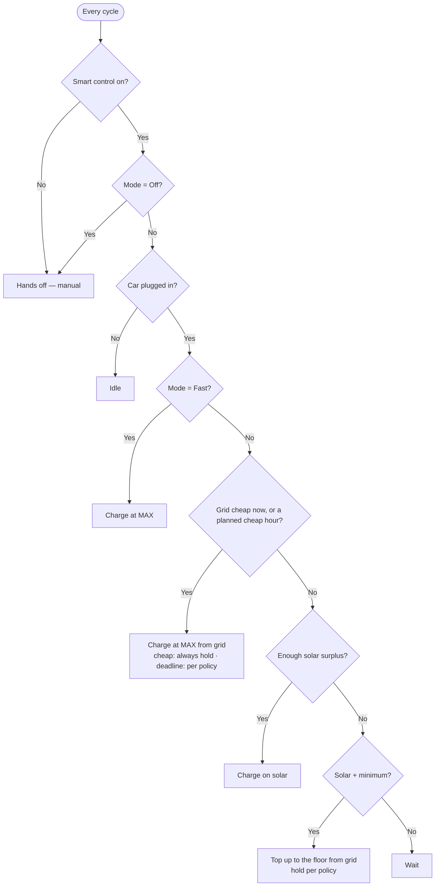

# Charging behavior matrix

What the brain does in every situation — by mode, price, and home-battery state. Derived from
the regulation engine ([`engine.py`](../custom_components/goe_steve/engine.py), `decide()`).

Defaults (all runtime-adjustable): **6 A min / 16 A max**, cheap grid **≤ 0.15 /kWh**,
home-battery **reserve 80 %** (Protect), **floor 20 %** (Assist), PV+minimum floor **1400 W**.

---

## You set two things

| You choose… | Answers | Options |
|---|---|---|
| **Mode** | Where the energy comes from | Off · Solar only · Solar + minimum · Solar + cheap grid · Price-optimized · Combined · Fast |
| **Battery policy** | How the home battery may help the car | Protect · Share · Assist |

**Modes in one line each:**

| Mode | What it does |
|---|---|
| **Off** | Hands off — manual control. |
| **Solar only** | Charge only on solar surplus. No sun, no charge. |
| **Solar + minimum** | Solar surplus, but never below a small floor (tops up from grid). |
| **Solar + cheap grid** | Solar surplus, **plus** full power whenever grid price ≤ cheap. |
| **Price-optimized** | Reach a target kWh by a departure time using the cheapest hours (ignores sun). |
| **Combined** | Solar surplus **+** cheap grid **+** the deadline guarantee. |
| **Fast** | Full power now, no questions. |

---

## How your home battery behaves (read this once)

A typical home battery **regulates the grid to ~0**: solar feeds **all loads first** (house +
car), leftover charges the battery, and any shortfall is covered by **discharging the
battery**. So **charging the car drains the battery by default** — the only thing that makes
the car pull from the *grid* instead is the **hold switch** (blocks discharge / raises the
grid setpoint).

Whether the brain protects the battery during a grid charge is decided by your **battery
policy** — using the battery is fine when the policy allows it. See [the hold switch](#the-hold-switch--when-it-kicks-in).

---

## The decision flow

Checked top-to-bottom every cycle; **first match wins.**



- The **"cheap / planned hour"** branch is only reachable by the price-aware modes (Solar +
  cheap grid, Price-optimized, Combined). The others answer *No* and go to the solar branch.
- **Price-optimized** ignores solar: outside a planned hour it just **waits**.

---

## What each mode commands

"MAX/MIN" = the current bounds; "full phases" = max phases when Auto-phase is on, else the
charger's current phase count (see [Phases](#phases)).

| Mode | Charges when… | Current | From |
|---|---|---|---|
| **Off** | — | — | manual |
| **Fast** | car connected | MAX | grid (+ battery per policy) |
| **Solar only** | surplus ≥ MIN | surplus, clamped MIN…MAX | solar |
| **Solar + minimum** | always | max(surplus, floor) | solar; **grid top-up** below the floor |
| **Solar + cheap grid** | price ≤ cheap **or** surplus ≥ MIN | MAX when cheap, else surplus | grid when cheap, else solar |
| **Price-optimized** | now is a planned cheap hour | MAX | grid |
| **Combined** | price ≤ cheap **or** planned hour **or** surplus ≥ MIN | MAX when grid-charging, else surplus | grid / solar |

When not charging you'll see a reason like *Waiting for surplus*, *Waiting for a cheaper
price window*, or *Waiting — home battery {soc}% < reserve {reserve}%* (Protect).

---

## Battery policy — what the car may take from solar

Surplus = **solar minus all other loads**, then adjusted per policy:

| Policy | Below its threshold | Above its threshold |
|---|---|---|
| **Protect** | surplus = **0** — car waits, battery fills to the **reserve** first | real surplus only (battery discharge subtracted, never sized onto the battery) |
| **Share** | car gets the solar that would have charged the battery (discharge subtracted) | same |
| **Assist** | reclaims battery-charge solar | above the **floor**, surplus is lifted to **MAX** so the **battery actively backs the car** |

---

## The hold switch — when it kicks in

The hold switch (block battery discharge / raise the grid setpoint) is driven **only while the
brain is grid-charging**. There are two cases:

**1. Cheap grid → always hold (grid only, never the battery).** Whenever the price is at/below
your cheap threshold (Solar + cheap grid, or the cheap branch of Combined), the hold is **ON
regardless of policy or SoC** — the stored battery energy is worth more than the cheap grid
you'd otherwise skip, so the car runs purely on the grid. Solar still tops the battery up.

**2. Fast / deadline plan / PV+minimum grid top-up → hold per battery policy.** These charge
from the grid for reasons other than a cheap price (charge now / hit a departure / guarantee a
floor), so the battery *may* help if the policy allows it:

| Policy | Hold turns **ON** when… | Hold stays **OFF** when… |
|---|---|---|
| **Protect** | always (any SoC) | — |
| **Share** | SoC **≤ reserve** (80 %) | SoC **> reserve** → battery may help the car at full power |
| **Assist** | SoC **≤ floor** (20 %) | SoC **> floor** → battery backs the car at full power |
| SoC unknown | Protect & Share hold (safe default) | Assist doesn't (can't prove it's above the floor) |

**Always OFF** when: not charging, or doing pure **solar-surplus** charging (so solar still
fills the battery, and Assist can back the car). This keeps the battery system within its own
boundaries whenever the brain isn't grid-charging. The same decision (cheap-grid or policy)
drives both the hold switch **and** the current-trim fallback, so they never disagree.

**No hold switch mapped?** When the policy *would* hold, the brain instead **trims the car's
current down to your solar surplus** (never below MIN) so it doesn't drain the battery — i.e.
a protecting policy quietly falls back to solar-only during grid windows. Map a hold entity if
you want true full-power grid charging that spares the battery.

```
 100% ┤ full
      │   PROTECT: hold ON whenever grid-charging (any SoC)
  80% ┤◄ reserve — SHARE: hold ON at/below; above, battery helps
      │
  20% ┤◄ floor   — ASSIST: hold ON at/below; above, battery backs the car
   0% ┤
```

---

## Phases

| Auto-phase | Charging type | Phases |
|---|---|---|
| Off (or no 3φ entity) | any | charger's current count, untouched |
| On | grid charging + Price mode | **max phases** (full power) |
| On | solar surplus | adaptive **1 ↔ 3φ**, prefers 1φ; up to 3φ once surplus sustains the 3φ minimum |

Hysteresis: up at `MIN × 3φ`, down at `MAX × 1φ`; a 300 s dwell caps how often it toggles.

---

## When the brain re-evaluates & writes

| Trigger | Cadence |
|---|---|
| Grid / PV / battery power changed | ~0.75 s debounce, then evaluate |
| Periodic safety poll | every 30 s |
| Setting changed (mode, policy, any number) | immediate |
| SteVe metering (never drives charging) | every 60 s |

Write shaping: PV/grid are **3-sample averaged**; current writes are throttled to **5 s**
(stops and phase changes bypass) with a **1 A** deadband; once charging starts/stops it holds
that state for a **120 s** anti-flap dwell. Each controlling cycle writes the **hold switch
first**, then start/stop, then the throttled current/phase.

---

## Safety

- Smart control off / Mode Off → brain hands off (manual). Car unplugged → idle.
- Stale or missing grid/charger data → hands off rather than acting on bad numbers.
- On hand-off the brain **releases** the force-state and turns the **hold switch off**.
