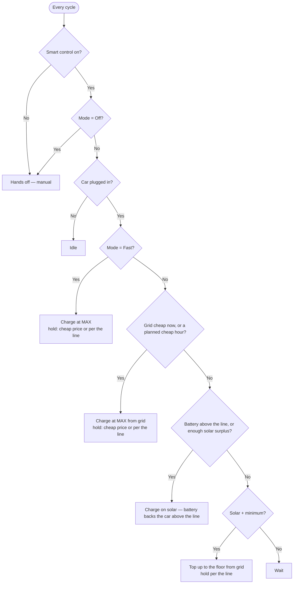

# Charging behavior matrix

What the brain does in every situation — by mode, price, and home-battery state. Derived from
the regulation engine ([`engine.py`](../custom_components/goe_steve/engine.py), `decide()`).

Defaults (all runtime-adjustable): **6 A min / 16 A max**, cheap grid **≤ 0.15 /kWh**,
home-battery **reserve line 100 %**, PV+minimum floor **1400 W**.

---

## You set two things

| You choose… | Answers | Options |
|---|---|---|
| **Mode** | Where the energy comes from | Off · Solar only · Solar + minimum · Solar + cheap grid · Price-optimized · Combined · Fast |
| **Home-battery reserve** | How full the battery must be before the car may use it | one number, 0–100 % |

**Modes in one line each:**

| Mode | What it does |
|---|---|
| **Off** | Hands off — manual control. |
| **Solar only** | Charge only on solar surplus. No sun, no charge. |
| **Solar + minimum** | Solar surplus, but never below a small floor (tops up from grid). |
| **Solar + cheap grid** | Solar surplus, **plus** full power whenever grid price ≤ cheap. |
| **Price-optimized** | Reach a target kWh by a departure time using the cheapest hours (ignores sun). |
| **Combined** | Solar surplus **+** cheap grid **+** the deadline guarantee. |
| **Fast** | Full power now, no questions. |

---

## The home-battery reserve line (read this once)

One number — **"Keep home battery above X %"** — answers the only battery question there is:
*may my home battery power the car, and down to what level?*

```
100 % ┤
      │   ABOVE the line — the car comes first:
      │   • the car takes solar surplus, including solar headed for the battery
      │   • the battery actively backs the car, down to the line
      │   • the hold switch stays OFF during grid charging
  X % ┤◄══ your reserve line ══════════════════════════════════════════
      │   BELOW the line — the battery comes first:
      │   • the car gets no solar surplus (all solar fills the battery)
      │   • only real grid charging runs: cheap hours, Fast, the deadline plan
      │   • the hold switch is ON whenever the brain grid-charges
  0 % ┤
```

- **At exactly the line** the reserve is satisfied: the car takes the solar that would push the
  battery higher, but any discharge is subtracted — the battery is never pulled below the line.
- **100 % = the battery never powers the car** (the conservative default). The car still
  charges on real solar excess once the battery is full.
- **SoC unavailable?** The car rides genuine solar excess only and the battery is always held
  during grid charging — never silently drained.

**One exception, and it's in your favor: cheap grid always wins.** Whenever the price is
at/below your cheap threshold, the car runs purely on the grid and the battery is held
**regardless of the line** — a stored kWh is worth the expensive-hour price it will offset
later, so burning it against cheap grid would be backwards. Solar still tops the battery up
during cheap hours.

---

## The decision flow

Checked top-to-bottom every cycle; **first match wins.**



- The **"cheap / planned hour"** branch is only reachable by the price-aware modes (Solar +
  cheap grid, Price-optimized, Combined). The others answer *No* and go to the solar branch.
- **Price-optimized** ignores solar: outside a planned hour it just **waits**.

---

## What each mode commands

"MAX/MIN" = the current bounds; "full phases" = max phases when Auto-phase is on, else the
charger's current phase count (see [Phases](#phases)).

| Mode | Charges when… | Current | From |
|---|---|---|---|
| **Off** | — | — | manual |
| **Fast** | car connected | MAX | grid (+ battery above the line) |
| **Solar only** | surplus ≥ MIN, or battery above the line | surplus, clamped MIN…MAX (MAX above the line) | solar (+ battery above the line) |
| **Solar + minimum** | always | max(surplus, floor) | solar; **grid top-up** below the floor |
| **Solar + cheap grid** | price ≤ cheap **or** solar branch above | MAX when cheap, else as Solar only | grid when cheap, else solar |
| **Price-optimized** | now is a planned cheap hour | MAX | grid |
| **Combined** | price ≤ cheap **or** planned hour **or** solar branch | MAX when grid-charging, else surplus | grid / solar |

When not charging you'll see a reason like *Waiting for surplus*, *Waiting for a cheaper
price window*, or *Waiting — home battery {soc}% < reserve {reserve}%*.

---

## The hold switch — when it kicks in

Background: a Victron-style system **always balances the grid to ~0**, covering any shortfall
from the battery — so during a grid charge the battery *would* silently supply the car. The
hold switch is the one lever that changes that. The brain drives it **only while it is
actively grid-charging** (Fast, cheap hour, deadline hour, Manual charging, PV+minimum
top-up), by one rule:

> **Hold is ON when the price is cheap (any mode), or the battery is at/below the reserve
> line, or its SoC is unknown. Otherwise the battery deliberately backs the car.**

- The cheap-price part is mode-independent: even a Fast or Manual charge during a cheap hour
  runs on the grid, never the battery.
- A deadline-plan hour that is *not* actually cheap follows the line — above it the battery
  may help hit the departure.

**Always OFF** when: not charging, or charging on solar/battery surplus (so solar still fills
the battery below the line, and the battery may back the car above it). The same decision
drives both the hold switch **and** the current-trim fallback, so they never disagree.

**Side effect worth knowing:** while hold is ON, the battery can't discharge for *anything* —
your house loads run on grid too, not just the car. During cheap hours that's what you want;
during a Fast charge below the line it's the price of protecting the reserve. The hold is
released the moment the grid charge ends.

**No hold switch mapped?** When the brain *would* hold, it instead **trims the car's current
down to the genuine solar surplus** (never below MIN) so the battery isn't drained — i.e. a
grid window quietly falls back to solar-only. Map a hold entity if you want true full-power
grid charging that spares the battery.

---

## Phases

| Auto-phase | Charging type | Phases |
|---|---|---|
| Off (or no 3φ entity) | any | charger's current count, untouched |
| On | grid charging + Price mode | **max phases** (full power) |
| On | solar surplus | adaptive **1 ↔ 3φ**, prefers 1φ; up to 3φ once surplus sustains the 3φ minimum |

Hysteresis: up at `MIN × 3φ`, down at `MAX × 1φ`; a 300 s dwell caps how often it toggles.

---

## When the brain re-evaluates & writes

| Trigger | Cadence |
|---|---|
| Grid / PV / battery power changed | ~0.75 s debounce, then evaluate |
| Periodic safety poll | every 30 s |
| Setting changed (mode, reserve, any number) | immediate |
| SteVe metering (never drives charging) | every 60 s |

Write shaping: PV/grid are **3-sample averaged**; current writes are throttled to **5 s**
(stops and phase changes bypass) with a **1 A** deadband; once charging starts/stops it holds
that state for a **120 s** anti-flap dwell. Each controlling cycle writes the **hold switch
first**, then start/stop, then the throttled current/phase.

---

## Safety

- Smart control off / Mode Off → brain hands off (manual). Car unplugged → idle.
- Stale or missing grid/charger data → hands off rather than acting on bad numbers.
- On hand-off the brain **releases** the force-state and turns the **hold switch off**.

---

## Migrating from v1 (Protect / Share / Assist)

The old battery policy and its two thresholds collapsed into the reserve line. On first start
after the update your setting is mapped automatically:

| Old policy | New reserve line | Behaves like |
|---|---|---|
| **Protect** | **100 %** | battery never powers the car; it fills first |
| **Share** | your old **reserve** (e.g. 80 %) | car yields below it; above it the battery now *backs* the car down to it |
| **Assist** | your old **floor** (e.g. 20 %) | battery backs the car down to the floor, as before |

The one capability that no longer exists is Share's middle ground ("car may intercept
battery-bound solar, but the battery never discharges"): above the line the battery now
actively helps. If you don't want that, raise the line.
